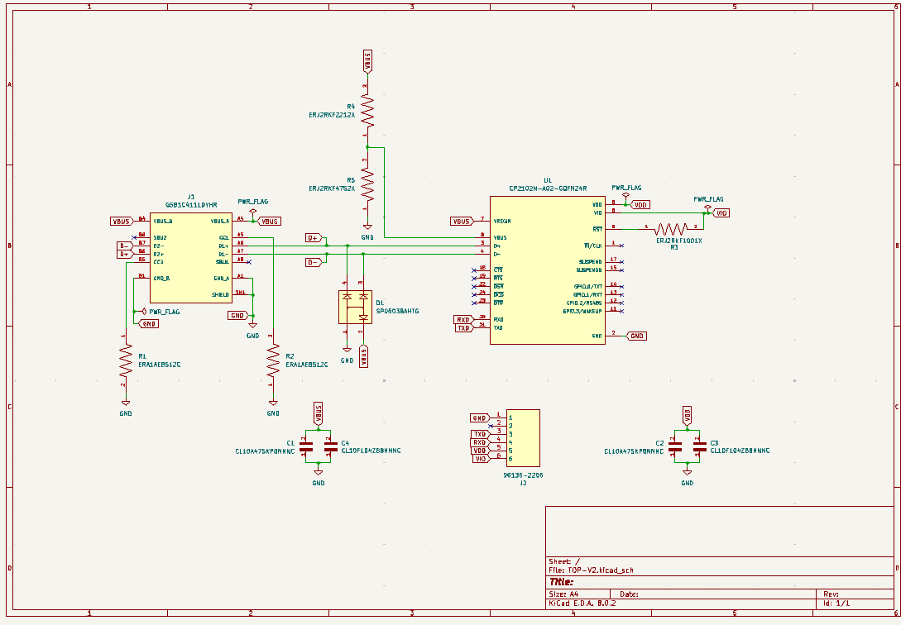
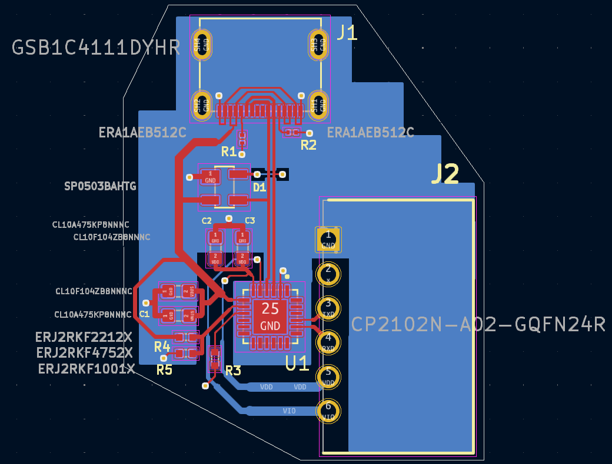
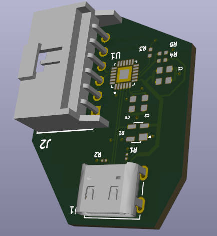
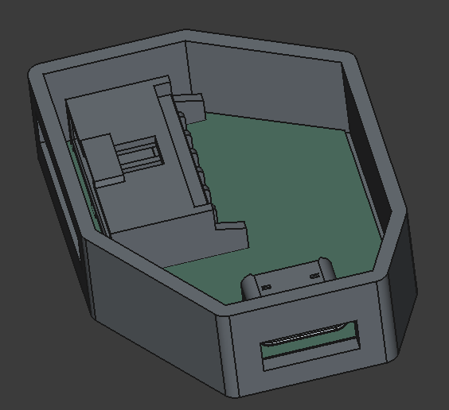
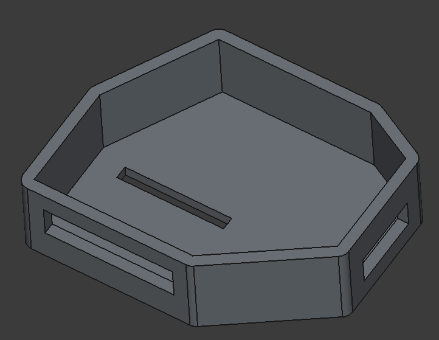
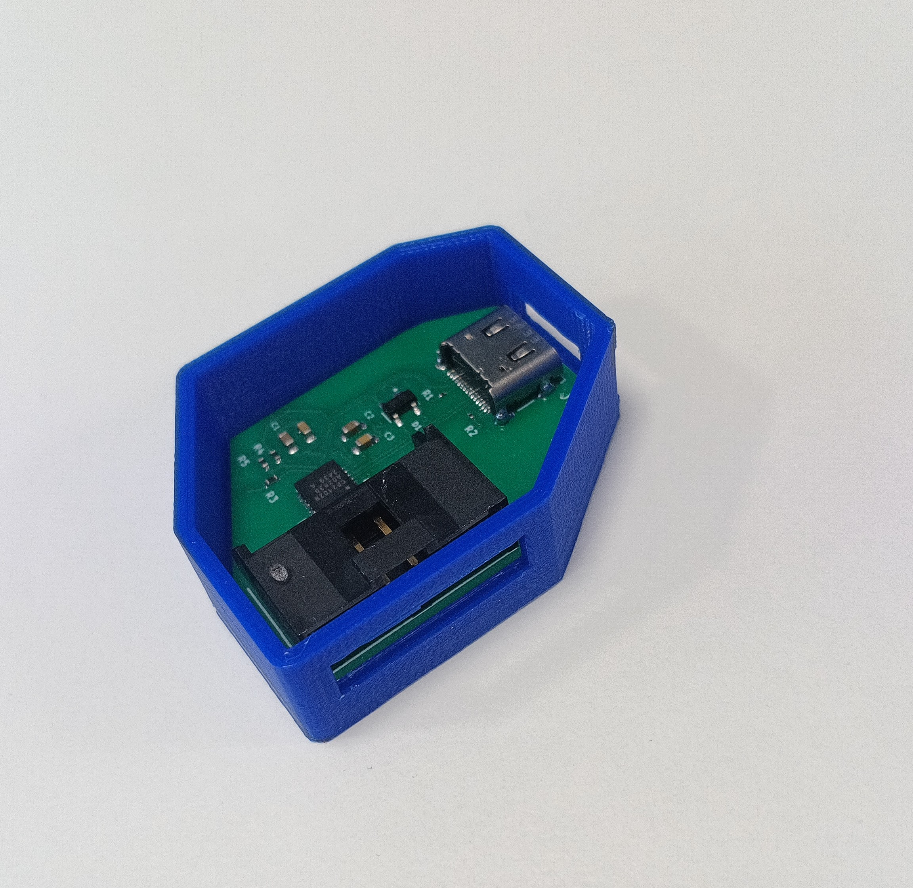

# about

This project enable the user to connect and read/write their UART signals via USBC.

Feel free to read more about the design and use process [here](https://substack.com/home/post/p-186289458)

## PCB electronics design

In [`TOP-V2`](./TOP-V2), the KiCad files for the project schematic and layout are available, which enable BOM, Gerber, and Centroid generation for manufacture and assembly.

Also the footprints and revelent 3D models needed to generate `.step` files for freeCAD housing design...

## PCB 3D-printed enclosure

In [`ENCLOSURE`](./ENCLOSURE), the freeCAD source files that enable us to generate a `.stl` - and therefore enable 3D-printed housing for the PCB

